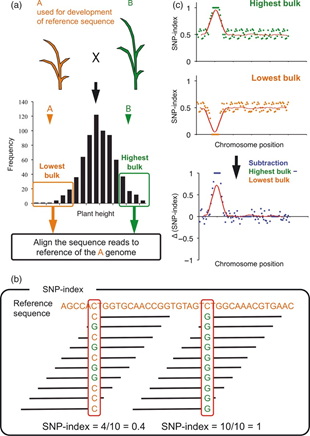
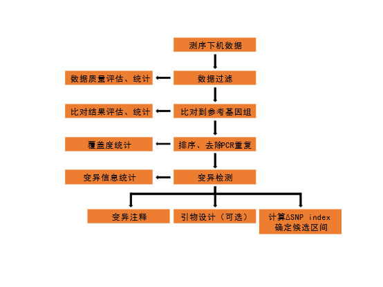

# QTLseq_workflow
This is a QTL-seq workflow, from NGS data to QTL-seq result.
# QTL-seq principle
QTL-seq[^1] is a method that combines Bulked-Segregant Analysis (BSA)[^2][^3] with high-throughput sequencing to quickly locate QTLs (Quantitative Trait Loci). In a segregating population constructed from parents with differing target traits, individuals with extreme phenotypes are selected and pooled in equal amounts to create two extreme phenotype bulked DNA pools, which are then sequenced. Subsequently, variation analysis is performed to screen SNP loci between the parents, and the SNP index is calculated for each SNP locus in both bulked DNA pools. The SNP index is the proportion of reads covering a particular parental genotype at a given SNP locus out of the total reads at that locus. By subtracting the SNP index of one bulked DNA pool from the other, the ΔSNP index is obtained. In all regions of the genome, the target gene and its linked regions will show different trends in the two bulked DNA pools due to opposite selection based on phenotype, resulting in a ΔSNP index that significantly deviates from around 0. On the other hand, regions unrelated to the target trait will exhibit similar trends in both bulked DNA pools, causing the ΔSNP index to fluctuate around 0 (Figure 1).



# Flow chart of QTL-seq

# Analytical method of QTL-seq
## Sampling, DNA Extraction, library construction and sequencing
Select 30-50 plants with extreme phenotypes from the segregating population, as well as young tissues from both parents, and extract DNA from each. Then, mix equal amounts of DNA from the extreme phenotype individuals to construct bulked DNA pools. Subsequently, perform library construction and high-throughput sequencing (the sequencing depth of the pooled DNA should match the number of individual plants in the pool). (The specific procedure should refer to the experimental design and the sequencing report from the company.)
## Sequencing data uality control
Use fastp[^4](version: 0.20.0) to filter the raw data to obtain clean data. Calculate and report the total bases, total reads, Q30, Q20, GC content, and effective data ratio before and after filtering (data_stat.csv/txt). Then, use FastQC (version: 0.11.9) to perform quality assessment on the data before and after filtering (QC/sample_fastqc.html).
## Alignment
Use Bowtie2[^5] (version: 2.4.1) software to align clean reads to the reference genome, obtaining SAM (Sequence Alignment/Map) format files, and calculate alignment statistics (01.Mapping/align_stat.csv). Subsequently, use SAMtools (version: 1.9) or Sambamba[^6] (version: 0.8.2) to sort the alignment results (SAM files) according the coordinates of reads, and convert them into BAM (Binary Alignment/Map) format files[^7]. Use Picard tools[^8] (version: 2.23.2) or Sambamba[^6] (version: 0.8.2) to remove PCR duplicates generated during library construction and calculate the genome coverage of each sample (01.Mapping/cov_stat.txt). Use PanDepth[^9] (version: 2.21) to calculate the coverage depth of reads after duplicate removal, with a window size of 100 kb.
## Calling variant
Calling variant is performed using the Genome Analysis Toolkit (GATK)[^10] (version: 3.8-0-ge9d806836). First, the HaplotypeCaller function of GATK is used to analyze each sample individually, then the CombineGVCFs function is used to merge the results. Subsequently, the GenotypeGVCFs function is employed to obtain SNP and INDEL information. Finally, the VariantFiltration function is used to filter the original variant sites to obtain reliable variant information.
## QTL-seq analysis
The R package easyQTLseq[^11] (version: 0.1.0) is used for QTL-seq analysis, with the following specific process:

When parental genotype is available (resequencing data or reference genome), we select Single Nucleotide Polymorphism (SNP) sites that are homozygous in both parents and different between parents (i.e., aa × bb) for QTL-seq analysis. First, we calculate the proportion of reads in the two pools that match the mutant parent type to the total coverage depth, which is the SNP index. Simultaneously, we delete SNPs where the SNP index in both pools is less than 0.3 or greater than 0.7. Then, we subtract the SNP index of the wild-type phenotype pool from that of the mutant phenotype pool to obtain the delta SNP index. Confidence intervals are obtained by simulating 10,000 times under the null hypothesis of no QTL, based on the given number of individuals in the pool and coverage depth. At the same time, we calculate the Euclidean Distance (ED) and its fourth power (ED^4^).

When parental genotype information is not available, we screen for polymorphic SNP sites. We calculate the proportion of different base coverage depths to the total depth at that site, remove SNPs where the proportion of different bases is simultaneously less than 0.3 or greater than 0.7, and calculate the Euclidean Distance (ED) and its fourth power (ED^4^).

$$
ED=\sqrt{(A_{mut}-A_{wt})^2+(C_{mut}-C_{wt})^2+(G_{mut}-G_{wt})^2+(T_{mut}-T_{wt})^2}
$$

We perform smoothing on the ΔSNP-index and Euclidean Distance (ED) values using a sliding window approach. This technique calculates statistical metrics over overlapping genomic intervals, effectively reducing noise and highlighting broad patterns across chromosomes. The smoothed data is then visualized in a plot where the x-axis represents the physical position along each chromosome, providing a genome-wide view of potential QTL regions.
## Variants annotation
To facilitate subsequent candidate gene mining, we use ANNOVAR[^12] to annotate the SNP sites from the QTL-seq analysis, as well as Insertion/Deletion (InDel) sites screened under the same criteria. This annotation identifies the location of variant sites (intergenic, upstream, downstream, 5'UTR, 3'UTR, intronic, splicing, or exonic) and their impact on protein-coding genes (synonymous, nonsynonymous, stopgain, stoploss, frameshift, or nonframeshift).
## Primer design
To conduct subsequent fine mapping, we use primer3[^13][^14] software to batch design primers based on the InDel sites screened above, and then use e-PCR (version: 2.3.12) to perform specificity testing.

E-PCR is time-consuming when primer targets multiple genomic regions, so `epcr.pl` will returns a timeout when the e-PCR time exceeds 2 seconds. `epcr_parallel.pl` is a parallel computing version of `epcr.pl`, which can further save time.

# Dependency
All the dependency and version are based on my current platform. The other version maybe compatible, but were untested.
## Basic
- perl v5.26.3
  - Getopt::Long 2.54
- Python 3.9.16
- R version 4.2.1
  - tidyverse_2.0.0
  - argparser_0.7.1
  - jsonlite_1.8.5
  - RColorBrewer_1.1-3
  - rmarkdown_2.22
  - knitr_1.43
  - DT_0.28
## Filter raw sequencing data
- fastp 0.23.2
- FastQC v0.11.9
## Mapping
- bwa 0.7.17-r1188
- bwa-mem2 2.2.1
- bowtie 2.4.5
- samtools 1.15.1
- sambamba 0.8.2
- picard 2.23.3
- PanDepth v2.21
- R version 4.2.1
  - circlize_0.4.16
## Calling variant
GATK 3.8-0-ge9d806836
bcftools 1.15.1
## QTL-seq analysis
- R version 4.2.1
  - easyQTLseq_0.1.0
## Annotation
- ANNOVAR 20191024
## Primer design
- seqkit v2.1.0
- primer3 2.6.1
- e-PCR 2.3.12
- perl v5.26.3
  - Parallel::ForkManager 2.02
  - List::Util 1.63
  - Bio::SeqIO 1.7.8

# Preparation
## Sample information
Prepare `00.data/samples.txt`, this is a tab-separated file with four columns (sampleName sampleInfo fq1 fq2), e.g.:
```
sampleA	highPhenoParent	<path to in1.fq of sampleA>	<path to in2.fq of sampleA>
sampleB	lowPhenoParent	<path to in1.fq of sampleB>	<path to in2.fq of sampleB>
sampleC	highPhenoBulk	<path to in1.fq of sampleC>	<path to in2.fq of sampleC>
sampleD	lowPhenoBulk	<path to in1.fq of sampleD>	<path to in2.fq of sampleD>
```
## Parameters for QTL-seq
Prepare `03.Analysis/Parameter.csv`, set corresponding sample name correctly and proper parameters for `easyQTLseq` package.

# Usage
## Set variables
Some variables should be set, which is included in `./script/.conf`.
## Run QTLseq pipeline
If all the files and variables are prepared, execute `run_QTLseq.sh`.
```bash
cd ./script
nohup sh run_QTLseq.sh &
```
When the pipeline is finished without error, all result should be generated in corresponding directory.

# Citation

If this pipeline is used in your research, it is recommended to cite this package
in the method section, like:

> The QTL-seq analysis was performed using R package easyQTLseq
> (<https://github.com/laowang1992/easyQTLseq.git>).

This paper is also recommended to cite:

> [Takagi H, Abe A, Yoshida K, et al. QTL-seq: rapid mapping of
> quantitative trait loci in rice by whole genome resequencing of DNA
> from two bulked populations. Plant J. 2013;74(1):174-183.
> doi:10.1111/tpj.12105](https://onlinelibrary.wiley.com/doi/10.1111/tpj.12105)


 # Reference
[^1]: Takagi, H., Abe, A., Yoshida, K., Kosugi, S., Natsume, S., Mitsuoka, C., Uemura, A., Utsushi, H., Tamiru, M., Takuno, S., Innan, H., Cano, L. M., Kamoun, S., & Terauchi, R. (2013). QTL-seq: rapid mapping of quantitative trait loci in rice by whole genome resequencing of DNA from two bulked populations. The Plant journal : for cell and molecular biology, 74(1), 174–183. https://doi.org/10.1111/tpj.12105
[^2]: Giovannoni, J. J., Wing, R. A., Ganal, M. W., & Tanksley, S. D. (1991). Isolation of molecular markers from specific chromosomal intervals using DNA pools from existing mapping populations. Nucleic acids research, 19(23), 6553–6558. https://doi.org/10.1093/nar/19.23.6553
[^3]: Michelmore, R. W., Paran, I., & Kesseli, R. V. (1991). Identification of markers linked to disease-resistance genes by bulked segregant analysis: a rapid method to detect markers in specific genomic regions by using segregating populations. Proceedings of the National Academy of Sciences of the United States of America, 88(21), 9828–9832. https://doi.org/10.1073/pnas.88.21.9828
[^4]: Chen, S., Zhou, Y., Chen, Y., & Gu, J. (2018). fastp: an ultra-fast all-in-one FASTQ preprocessor. Bioinformatics (Oxford, England), 34(17), i884–i890. https://doi.org/10.1093/bioinformatics/bty560
[^5]: Langmead, B., & Salzberg, S. L. (2012). Fast gapped-read alignment with Bowtie 2. Nature methods, 9(4), 357–359. https://doi.org/10.1038/nmeth.1923
[^6]: Tarasov, A., Vilella, A. J., Cuppen, E., Nijman, I. J., & Prins, P. (2015). Sambamba: fast processing of NGS alignment formats. Bioinformatics (Oxford, England), 31(12), 2032–2034. https://doi.org/10.1093/bioinformatics/btv098
[^7]: Li, H., Handsaker, B., Wysoker, A., Fennell, T., Ruan, J., Homer, N., Marth, G., Abecasis, G., Durbin, R., & 1000 Genome Project Data Processing Subgroup (2009). The Sequence Alignment/Map format and SAMtools. Bioinformatics (Oxford, England), 25(16), 2078–2079. https://doi.org/10.1093/bioinformatics/btp352
[^8]: “Picard Toolkit.” 2019. Broad Institute, GitHub Repository. http://broadinstitute.github.io/picard/; Broad Institute
[^9]: Yu, H., Shi, C., He, W., Li, F., & Ouyang, B. (2024). PanDepth, an ultrafast and efficient genomic tool for coverage calculation. Briefings in bioinformatics, 25(3), bbae197. https://doi.org/10.1093/bib/bbae197
[^10]: McKenna, A., Hanna, M., Banks, E., Sivachenko, A., Cibulskis, K., Kernytsky, A., Garimella, K., Altshuler, D., Gabriel, S., Daly, M., & DePristo, M. A. (2010). The Genome Analysis Toolkit: a MapReduce framework for analyzing next-generation DNA sequencing data. Genome research, 20(9), 1297–1303. https://doi.org/10.1101/gr.107524.110
[^11]: Wang, P. (2023). easyQTLseq: A R Package for QTLseq Analysis. https://github.com/laowang1992/easyQTLseq.git
[^12]: Wang, K., Li, M., & Hakonarson, H. (2010). ANNOVAR: functional annotation of genetic variants from high-throughput sequencing data. Nucleic acids research, 38(16), e164. https://doi.org/10.1093/nar/gkq603
[^13]: Untergasser, A., Cutcutache, I., Koressaar, T., Ye, J., Faircloth, B. C., Remm, M., & Rozen, S. G. (2012). Primer3--new capabilities and interfaces. Nucleic acids research, 40(15), e115. https://doi.org/10.1093/nar/gks596
[^14]: Koressaar, T., & Remm, M. (2007). Enhancements and modifications of primer design program Primer3. Bioinformatics (Oxford, England), 23(10), 1289–1291. https://doi.org/10.1093/bioinformatics/btm091

